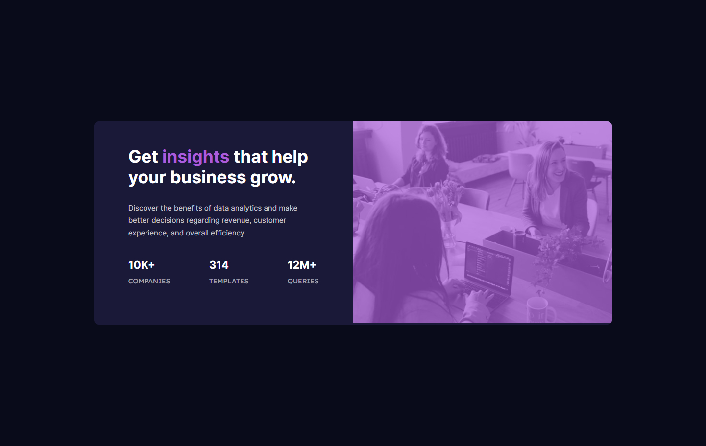
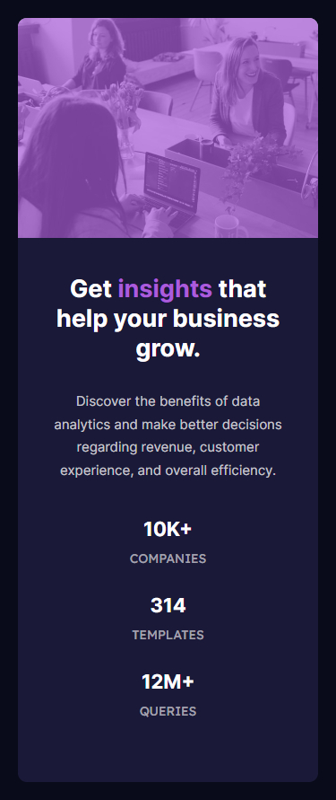

# Frontend Mentor - Stats preview card component solution

This is a solution to the [Stats preview card component challenge on Frontend Mentor](https://www.frontendmentor.io/challenges/stats-preview-card-component-8JqbgoU62). Frontend Mentor challenges help you improve your coding skills by building realistic projects. 

## Table of contents

- [Overview](#overview)
  - [The challenge](#the-challenge)
  - [Screenshot](#screenshot)
  - [Links](#links)
- [My process](#my-process)
  - [Built with](#built-with)
  - [What I learned](#what-i-learned)
- [Author](#author)

## Overview

### The challenge

Users should be able to:

- View the optimal layout depending on their device's screen size

### Screenshot




### Links

- Solution URL: [Solution URL](https://github.com/YahiaG/Stats-preview-card-component)
- Live Site URL: [Live Site URL](https://yahiag.github.io/Stats-preview-card-component/)

## My process

### Built with

- Semantic HTML5 markup
- CSS custom properties
- Flexbox
- CSS Grid
- Mobile-first workflow

### What I learned

I learnt how to add different images for different screen sizes. By changing background of an empty div.

```html
      <div class="image"></div>
```
```css
@media (max-width: 767px) {
    .card .image {
        height: 245px;
        background-image: url(images/image-header-mobile.jpg);
    }
}
@media (min-width: 768px) {
    .card .image {
        max-height: 412px;
        background-image: url(images/image-header-desktop.jpg);
        width: 50%;
    }
}
```

## Author

- Frontend Mentor - [@Yahia Ali](https://www.frontendmentor.io/profile/YahiaG)
- LinkedIn - [Yahia Ali](https://www.linkedin.com/in/Yahia-Ali22)

